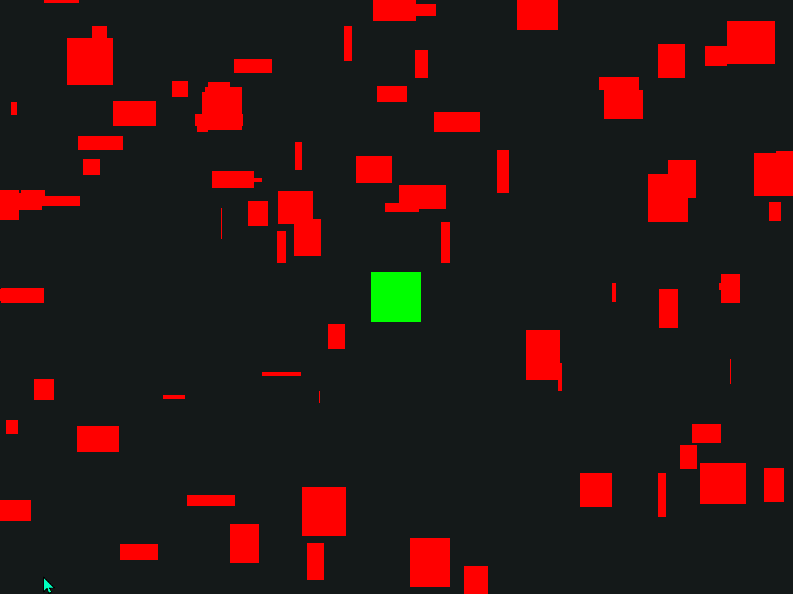
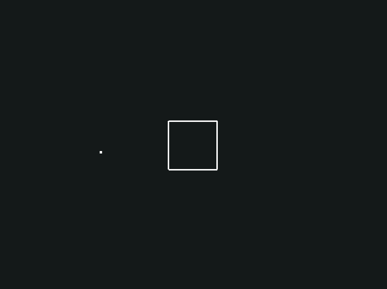
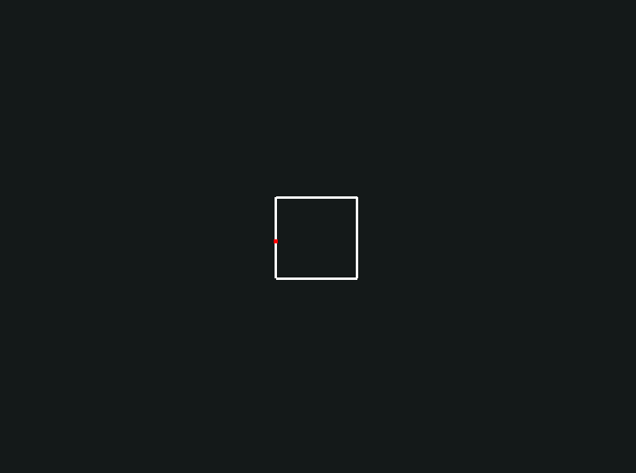
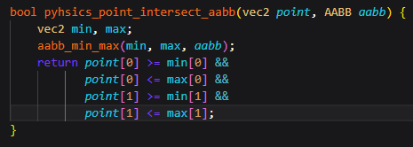

# My Custom 2D Game engine and Game :) 

## The first steps into having real working physics :)

I was able to create multiple randomly sized quads and have them bounce around the screen
2/2/2025

## Collision detection!

As of right now the cursor is replaced by a small quad, and it should be red when it is inside this other quad, but is only red when it is over the first rendered line. Need to figure this out. :)
2/6/2025

## Got it!

The problem was some wrong numbers in the interscect function in physics.c :) 2/7/2025

[video of it working](https://youtu.be/-5_ugKsjF38)
